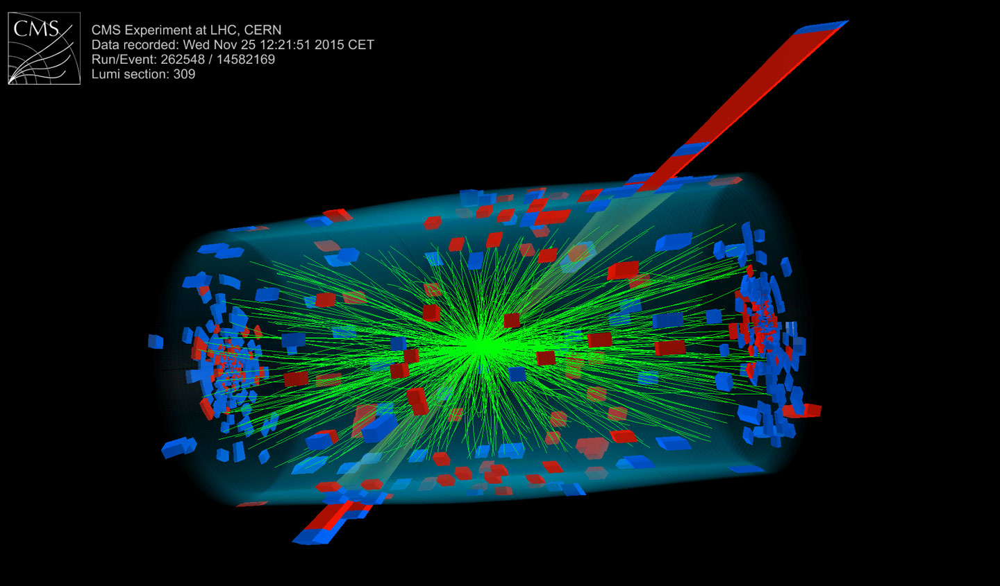

<br/>
<p align="center">
  <a href="https://github.com/DannyBozbay/CERN-Gradient-Boosting">
    
  </a>

  <h3 align="center">CERN Data: Gradient Boosting</h3>

  <p align="center">
    Predicting the invariant mass of electrons using Gradient Boosting!
    <br/>
    <br/>
    <a href="https://github.com/DannyBozbay/CERN-Gradient-Boosting"><strong>Explore the docs »</strong></a>
    <br/>
    <br/>
  </p>
</p>

    

## Table Of Contents

* [About the Project](#about-the-project)
* [Installation](#installation)
* [License](#license)
* [Authors](#authors)

## About The Project

The goals of this project are:

- To utilise **Gradient Boosting** and effective **Feature Engineering** to predict the invariant mass of two electrons resulting from particle collision events.

- To demonstrate the power of machine learning **Pipelines**. 

Invariant mass is a concept widely used in particle physics, including experiments conducted at CERN (European Organization for Nuclear Research). Invariant mass is a measure of the mass of a system of particles, calculated in a way that remains constant regardless of the frame it's measured in.

One of the key applications of invariant mass at CERN is in the analysis of particle collisions. Invariant mass helps physicists identify and study new particles by looking at the mass of the decay products. If there is a cluster of particles that share a common invariant mass, it suggests that these particles might have originated from the decay of a common parent particle. This is crucial for discovering and understanding new particles, such as those predicted by theoretical frameworks like the Standard Model of particle physics or extensions to it.

There is actually a well known formula for calculating invariant mass in the context of special relativity, given by:

$m_0^2c^4 = E^2 - p^2c^2$

Can we build a regression model that can learn this relationship? This is the question our project tries to answer (spoiler: the answer is yes... for simple dielectron events).

A great Kaggle dataset was used to train/test model. You can find my Kaggle notebook [here](https://www.kaggle.com/code/danielbozbay/cern-data-end-to-end-gradient-boosting-0-9-rmse). Please upvote it if you found it useful :)


## Installation

1. Clone the repository

```bash
git clone https://github.com/dannybozbay/cern-gradient-boosting.git
```

2. Create a Python environment with required dependencies:

Python 3.11 or higher using `venv` or `conda`. Using `venv`:

```bash
cd cern-gradient-boosting
python3 -m venv env
source env/bin/activate
```

Using `conda`:

``` bash
cd cern-gradient-boosting
conda env create --file environment.yml
conda activate CERN-Gradient-Boosting
```

## License

Distributed under the MIT License. See [LICENSE](https://github.com/DannyBozbay/CERN-Gradient-Boosting/blob/main/LICENSE.md) for more information.

## Authors

* **Danny Bozbay** - *Theoretical Physics Graduate* - [Danny Bozbay](https://github.com/DannyBozbay/)


